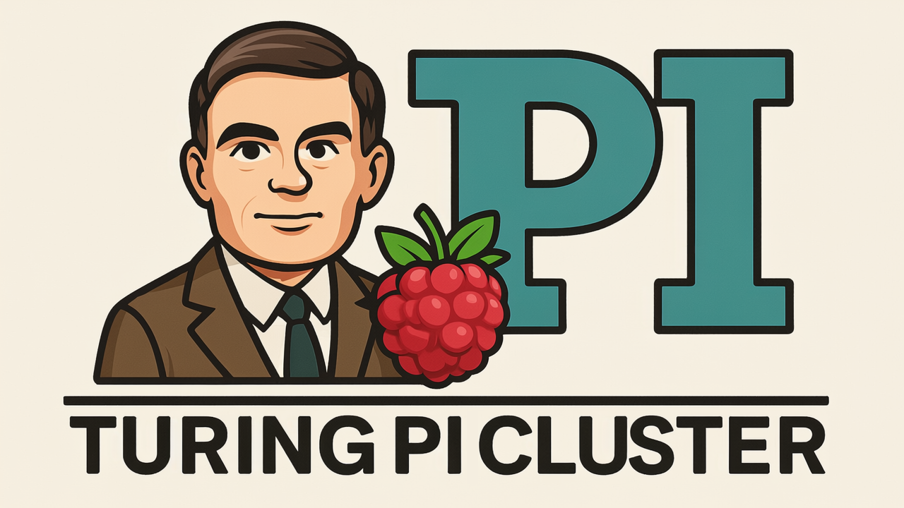

<p align="center">
  
</p>
<p align="center">
    <h3 align="center">❯ Turing Pi 2 Home cluster
</h3>

<p align="center">
	<!-- local repository, no metadata badges. --></p>

<p align="center">
  
</p>

<p align="center">
  
  
  
  
</p>
<p align="center">
  
  
  
  
</p>

# Turing Pi 2 Home cluster

## The Setup

This repository contains the configuration for a home Kubernetes cluster running on a Turing Pi 2. It includes the necessary files to deploy various services, from storage to media servers.

### The Prerequisites

Before you can deploy the services, you need to set up the cluster's core components. This involves installing MetalLB, an Nginx Ingress Controller, and CoreDNS.

#### MetalLB

MetalLB provides a network load-balancer for bare-metal Kubernetes clusters.

```bash
helm repo add metallb https://metallb.github.io/metallb
helm install metallb metallb/metallb --namespace metallb-system --create-namespace
```

#### Nginx Ingress Controller

The Nginx Ingress Controller uses NGINX as a reverse proxy and load balancer.

```bash
helm repo add ingress-nginx https://kubernetes.github.io/ingress-nginx
helm install ingress-nginx ingress-nginx/ingress-nginx --namespace ingress-nginx --create-namespace
```

#### CoreDNS

CoreDNS is a flexible and extensible DNS server for your cluster.

```bash
helm install coredns coredns/coredns \
  --namespace=kube-system \
  --set service.clusterIP=10.43.0.10 \
  --set service.name=kube-dns \
  --set isClusterService=true \
  --set serviceType=ClusterIP \
  --set prometheus.service.enabled=true \
  --set kubernetes.clusterDomain=cluster.local
```

### The Storage

The storage is managed via Helm and supports both NFS and NAS configurations. You can deploy it using the following command:

```bash
helm install storage ./config/storage
```

You can customize the storage configuration by modifying the `values.yaml` file in the `config/storage` directory.

## The Applications

This repository includes Helm charts for various applications. You can find them in the `services` directory. To deploy an application, use the `helm install` command with the appropriate chart.

```