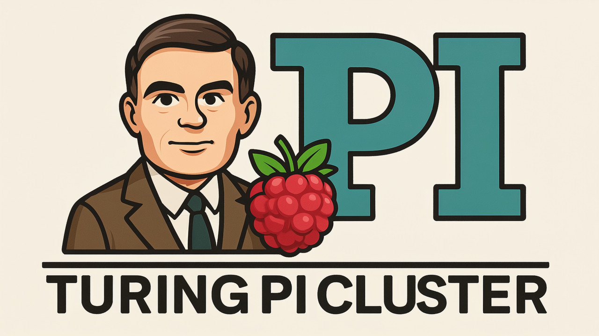

<p align="center">
  
</p>
<p align="center">
    <h3 align="center">❯ Turing Pi 2 Home cluster
</h3>

<p align="center">
	<!-- local repository, no metadata badges. -->
</p>

<p align="center">
  
</p>

<p align="center">
  
  
  
  
</p>
<p align="center">
  
  
  
  
</p>

# Turing Pi 2 Home cluster

## 📖 Table of Contents

*   [The Story](#-the-story)
*   [What you need to start](#-what-you-need-to-start)
*   [The Setup](#-the-setup)
    *   [How to install the k3s cluster](#-how-to-install-the-k3s-cluster)
    *   [The Prerequisites](#-the-prerequisites)
    *   [The Storage](#-the-storage)
*   [The Applications](#-the-applications)
*   [Contributing](#-contributing)
*   [License](#-license)

## 📖 The Story

This project has been a long journey. If you want to read the full story, from the unboxing of the Turing Pi 2 to the final setup, you can read it [here](./assets/docs/STORY.md).

## 🚀 What you need to start

To work with this cluster, you will need to install the following tools:

*   **kubectl**: The Kubernetes command-line tool, allows you to run commands against Kubernetes clusters. You can find the installation guide [here](https://kubernetes.io/docs/tasks/tools/install-kubectl/).
*   **helm**: A package manager for Kubernetes, which helps you manage Kubernetes applications. You can find the installation guide [here](https://helm.sh/docs/intro/install/).
*   **sops**: A tool for managing secrets with encryption. You can find the installation guide [here](https://github.com/getsops/sops).

## 🛠️ The Setup

This repository contains the configuration for a home Kubernetes cluster running on a Turing Pi 2. It includes the necessary files to deploy various services, from storage to media servers.

### ⚙️ How to install the k3s cluster

The k3s cluster is installed using Ansible and the [k3s-ansible](https://github.com/k3s-io/k3s-ansible) playbook.

1.  First, clone the `k3s-ansible` repository:

    ```bash
    git clone https://github.com/k3s-io/k3s-ansible.git
    ```

2.  Navigate into the cloned directory:

    ```bash
    cd k3s-ansible
    ```

3.  **`config/inventory.yml` is encrypted with SOPS.** Ansible does not decrypt SOPS files on its own — running `ansible-playbook` directly against the encrypted file passes encrypted fields (like `token`) through as their literal ciphertext string, not the real value. This once broke the live cluster's k3s token and took down the control plane. Always decrypt to a temporary file first, run against that, then delete it:

    ```bash
    sops -d /path/to/turing-pi-server/config/inventory.yml > /tmp/inventory-plain.yml
    ansible-playbook playbooks/site.yml -i /tmp/inventory-plain.yml
    rm -f /tmp/inventory-plain.yml
    ```

    (Note the playbook lives at `playbooks/site.yml` in newer checkouts of k3s-ansible, not `site.yml`.)

### 💾 turing-03's containerd storage lives on its local SSD, not the SD card

`turing-03` has a 1TB SSD (`/dev/sda`, mounted at `/mnt/ssd`) physically attached — the same drive it exports over NFS to the other 4 nodes. Its own SD card is only ~6.7GB shared between the OS, k3s, and every container image/pod's ephemeral storage on that node, which made it the most consistently disk-pressured node in the cluster (it's also the control-plane node, so this mattered more than for the agents).

Since the SSD is genuinely local to `turing-03` (no NFS involved for its own use), containerd's data directory is bind-mounted onto it instead of living on the SD card. This only applies to `turing-03` — the other 4 nodes don't have physical access to this drive, so their containerd storage stays on their own SD cards.

If `turing-03` is ever reflashed/reprovisioned, redo this before rejoining it to the cluster:

```bash
ssh pi@192.168.2.103 '
set -e
sudo systemctl stop k3s
sudo mkdir -p /mnt/ssd/k3s-containerd
sudo rsync -a /var/lib/rancher/k3s/agent/containerd/ /mnt/ssd/k3s-containerd/
sudo mv /var/lib/rancher/k3s/agent/containerd /var/lib/rancher/k3s/agent/containerd.old
sudo mkdir -p /var/lib/rancher/k3s/agent/containerd
echo "/mnt/ssd/k3s-containerd /var/lib/rancher/k3s/agent/containerd none bind 0 0" | sudo tee -a /etc/fstab
sudo mount -a
sudo systemctl start k3s
'
```

Verify the bind mount took (`df -h /var/lib/rancher/k3s/agent/containerd` should show `/dev/sda`, ~938G) and `k3s` is `active` before deleting `containerd.old` to reclaim the SD card space.

### ✅ The Prerequisites

Before you can deploy the services, you need to set up the cluster's core components. This involves installing MetalLB, an Nginx Ingress Controller, and CoreDNS.

#### MetalLB

MetalLB provides a network load-balancer for bare-metal Kubernetes clusters.
    
```bash
    helm repo add metallb https://metallb.github.io/metallb
    helm install metallb metallb/metallb --namespace metallb-system --create-namespace
```


#### Nginx Ingress

The Nginx Ingress Controller uses NGINX as a reverse proxy and load balancer.

```bash
    helm repo add ingress-nginx https://kubernetes.github.io/ingress-nginx
    helm install ingress-nginx ingress-nginx/ingress-nginx --namespace ingress-nginx --create-namespace
```
## Manual Deployment

To deploy all services, including the centralized secrets:

```bash
./deploy-services.sh
```

To deploy a single service manually, you must include the global values file to ensure secrets (like `regcred`) are configured correctly:

```bash
# Standard deployment
helm upgrade -i <service-name> ./services/<service-name> -f config/global-values.yaml

# Deployment with SOPS secrets
helm secrets upgrade -i <service-name> ./services/<service-name> -f config/global-values.yaml -f ./services/<service-name>/secrets.yaml
```

## CI/CD Features

- **Skip Deployment**: Start your commit message with `[skip-deploy]` to skip the deployment step in the pipeline.
- **Parallel Detection**: The pipeline checks for changes in `services/` and `config/` (storage/secrets) in parallel.
- **Global Secrets**: `cluster-secrets` are automatically deployed if changes are detected in `config/secrets`.

#### CoreDNS

CoreDNS is a flexible and extensible DNS server for your cluster.

```bash
    helm install coredns coredns/coredns \
      --namespace=kube-system \
      --set service.clusterIP=10.43.0.10 \
      --set service.name=kube-dns \
      --set isClusterService=true \
      --set serviceType=ClusterIP \
      --set prometheus.service.enabled=true \
      --set kubernetes.clusterDomain=cluster.local
```

### 💾 The Storage

The storage is managed via Helm and supports both NFS and NAS configurations. You can deploy it using the following command:

```bash
    helm install storage ./config/storage
```

You can customize the storage configuration by modifying the `values.yaml` file in the `config/storage` directory.

## 📦 The Applications

This repository includes Helm charts for various applications. You can find them in the `services` directory. To deploy an application, use the `helm install` command with the appropriate chart.

```bash
    ./deploy-services.sh
```

## 🤝 Contributing

Contributions, issues and feature requests are welcome!
Feel free to check [issues page](https://github.com/tomassirio/turing-pi-server/issues).

## 📝 License

This project is [MIT](./LICENSE) licensed.
