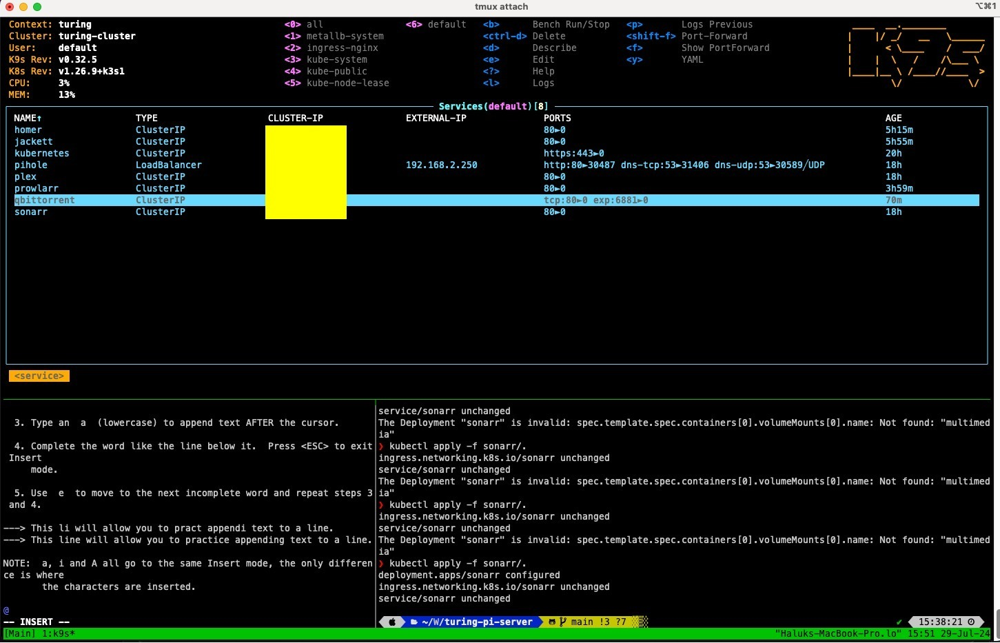

[//]: # (References)





# Turing Pi 2 Home cluster

## The Story

On June 2022 I came across a kickstarter about a board possible of having up to 4 Raspberry Pi 4 Compute Modules at once. Without  giving it too much of a thought, I bought the board.

2 years later, I still had my Turing Pi 2 unopened in its box in a shelf. Life happens and I was still unsure on why I've bought it in the first place.


But I decided to still give it a try. I wanted to learn more about clustering and had never mounted a complete Kubernetes one from scratch before. So I got myself into spending-mode and bought 3 Raspberry Pi 4s 8gb Ram 8gb Internal storage + 1 Nvidia Jetson Nano 4gb.


Given the board's capabilities, I was also able to mix the Compute Modules I was going to use, thus, I decided buying a Jetson Nano as well. Maybe this way I could play around CUDA drivers in the feature and learn some machine learning as well. And why not, having my own GPT assistant hosted with kubernetes.

## The Set-up

It's been a while since I put together a computer, and it was the first time I played around compute modules with their Compute module adapters, so that was plenty of fun for the weekend.
Since my wallet was hot but still not burning, I thought, why the hell not add a nice case for it.

Given the Mini ITX form factor of the board, I could fit it into whatever fancy ITX case I could find in Amazon. The Qube 500 got me through and through. I was already making a DIY cluster, the best case for such a thing, was a DIY as well.

I also added a 650W power supply (total overkill), one small Wi-Fi Mini PCI Express cad and a 1tb Sata SSD.

Putting up the 'thing' together was fairly simple. A bit of thermal paste between the Compute Modules and their heat sinks and clutching them together with their Adapters before setting them up in order in the Turing Board;

I mention the order because it was a significant part of the project. The Turing Pi 2 offers management of its ports distributed throughout the compute modules. In this case, the PCI Express 1 was managed by the First node while the SSD drive was managed by the 3rd one. The 2nd could handle the NVME port and the 4th one the other SSD IIRC but I had no use for them right now.

## The Flashing

I've installed Raspberry Pis before, but never Compute Modules. The Turing Pi 2 has a USB port in the back which is as File # Turing Pi 2 Home cluster

## The Story

On June 2022 I came across a kickstarter about a board possible of having up to 4 Raspberry Pi 4 Compute Modules at once. Without giving it too much of a thought, I bought the board.

2 years later, I still had my Turing Pi 2 unopened in its box in a shelf. Life happens and I was still unsure on why I've bought it in the first place.

But I decided to still give it a try. I wanted to learn more about clustering and had never mounted a complete Kubernetes one from scratch before. So I got myself into spending-mode and bought 3 Raspberry Pi 4s 8gb Ram 8gb Internal storage + 1 Nvidia Jetson Nano 4gb.

Given the board's capabilities, I was also able to mix the Compute Modules I was going to use, thus, I decided buying a Jetson Nano as well. Maybe this way I could play around CUDA drivers in the feature and learn some machine learning as well. And why not, having my own GPT assistant hosted with kubernetes.

## The Set-up

It's been a while since I put together a computer, and it was the first time I played around compute modules with their Compute module adapters, so that was plenty of fun for the weekend.
Since my wallet was hot but still not burning, I thought, why the hell not add a nice case for it.

Given the Mini ITX form factor of the board, I could fit it into whatever fancy ITX case I could find in Amazon. The Qube 500 got me through and through. I was already making a DIY cluster, the best case for such a thing, was a DIY as well.

I also added a 650W power supply (total overkill), one small Wi-Fi Mini PCI Express cad and a 1tb Sata SSD.

Putting up the 'thing' together was fairly simple. A bit of thermal paste between the Compute Modules and their heat sinks and clutching them together with their Adapters before setting them up in order in the Turing Board;

I mention the order because it was a significant part of the project. The Turing Pi 2 offers management of its ports distributed throughout the compute modules. In this case, the PCI Express 1 was managed by the First node while the SSD drive was managed by the 3rd one. The 2nd could handle the NVME port and the 4th one the other SSD IIRC, but I had no use for them right now.

I've flashed Raspberry Pis before, but I've never flashed a Compute Module. The Turing Pi 2 has a USB port in the back that allows for both File Transfer and Flashing capabilities. Unfortunately for me, I tried connecting my Mac to the cluster with a USB-C to USB-A only for power supply. I didn't realize the cable was the issue at the moment, so I went the hard way to flash my CMs.

### The Hard Way


# Turing Pi Server

This repository contains Kubernetes manifests for deploying Sonarr and Plex on a cluster with an NFS-backed persistent storage.

## Setup Instructions

1. Apply storage configurations:
    ```sh
    kubectl apply -f storage/nfs-pv.yaml
    kubectl apply -f storage/nfs-pvc.yaml
    ```

2. Deploy Sonarr:
    ```sh
    kubectl apply -f sonarr/deployment.yaml
    kubectl apply -f sonarr/service.yaml
    kubectl apply -f sonarr/ingress.yaml
    ```

3. Deploy Plex:
    ```sh
    kubectl apply -f plex/deployment.yaml
    kubectl apply -f plex/service.yaml
    kubectl apply -f plex/ingress.yaml
    ```

## Directory Structure

- `sonarr/` contains the deployment, service, and ingress definitions for Sonarr.
- `plex/` contains the deployment, service, and ingress definitions for Plex.
- `storage/` contains the persistent volume (PV) and persistent volume claim (PVC) definitions.
