# Turing Pi 2 Home cluster

# Table of Contents
- [The Story](#the-story)
- [The Plan](#the-plan)
  - [Turing Pi 2](#turing-pi-2)
- [The Setup](#the-set-up)
- [The Flashing](#the-flashing)
  - [The Storage](#the-storage)
  - [The Kubernetes](#the-kubernetes-cluster)
- [The Applications](#the-applications)
- [The final build](#the-final-build)
- [The Future](#the-future)
- [The End](#the-end)


<details>
<summary>Click to expand glossary</summary>

- [Kickstarter](https://www.kickstarter.com/) - A crowdfunding platform for creative projects.
- [Raspberry Pi 4 Compute Module](https://www.raspberrypi.com/products/compute-module-4/?variant=raspberry-pi-cm4001000) - A compact form factor of the Raspberry Pi 4.
- [Turing Pi 2](https://turingpi.com/product/turing-pi-2-5/) - A board capable of hosting multiple Raspberry Pi Compute Modules.
- [Kubernetes](https://kubernetes.io/) - An open-source system for automating deployment, scaling, and management of containerized applications.
- [Nvidia Jetson Nano](https://www.nvidia.com/en-us/autonomous-machines/embedded-systems/jetson-nano/product-development/) - A small, powerful computer for AI applications.
- [Qube 500](https://www.coolermaster.com/en-au/products/qube-500-flatpack-bw-edition/) - A DIY computer case from Cooler Master.
- [Tmux](https://github.com/tmux/tmux) - A terminal multiplexer.
- [Neofetch](https://github.com/dylanaraps/neofetch) - A command-line system information tool.
- [Jeff Geerling's YouTube Channel](https://www.youtube.com/@JeffGeerling) - A channel with various tech tutorials, including Kubernetes setups.
- [K3s](https://k3s.io/) - A lightweight Kubernetes distribution.
- [Ansible](https://github.com/k3s-io/k3s-ansible) - An open-source software provisioning, configuration management, and application-deployment tool.
- [K9s](https://k9scli.io/) - A terminal based UI to interact with your Kubernetes clusters.
- [Pi-hole](https://pi-hole.net/) - A network-wide ad blocker.
- [RetroArch](https://www.retroarch.com/) - A frontend for emulators, game engines and media players.
- [GitHub Repository](https://github.com/tomassirio/turing-pi-server) - The repository for managing Kubernetes configurations for this project.
- [Sonarr](https://sonarr.tv/) - A PVR for usenet and bittorrent users.
- [Radarr](https://radarr.video/) - A movie collection manager for Usenet and BitTorrent users.
- [Prowlarr](https://prowlarr.com/) - An indexer manager/proxy for PVR apps.
- [Jellyfin](https://jellyfin.org/) - A free software media system.
- [qBittorrent](https://www.qbittorrent.org/) - A free and open-source BitTorrent client.
- [Prometheus](https://prometheus.io/) - An open-source monitoring and alerting toolkit.
- [Grafana](https://grafana.com/) - An open-source platform for monitoring and observability.

</details>

## The Story

In June 2022 I came across a [Kickstarter](https://www.kickstarter.com/) about a board possible of having up to 4 [Raspberry Pi 4 Compute Modules](https://www.raspberrypi.com/products/compute-module-4/?variant=raspberry-pi-cm4001000) at once.
Without much deliberation, I decided to back the project and purchase the board.

Fast-forward two years, and my [Turing Pi 2](https://turingpi.com/product/turing-pi-2-5/) was still sitting unopened in its box on a shelf
Life had gotten in the way, and I was unsure why I had bought it in the first place.

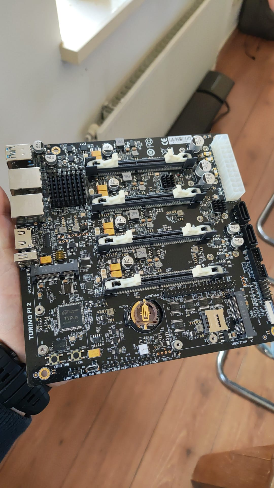

However, I finally decided to give it a try. I wanted to learn more about clustering and had never built a complete [Kubernetes](https://kubernetes.io/) cluster from scratch before. So, I went into spending mode and acquired three Raspberry Pi 4s (8GB RAM, 8GB internal storage) and one [Nvidia Jetson Nano](https://www.nvidia.com/en-us/autonomous-machines/embedded-systems/jetson-nano/product-development/) (4GB).

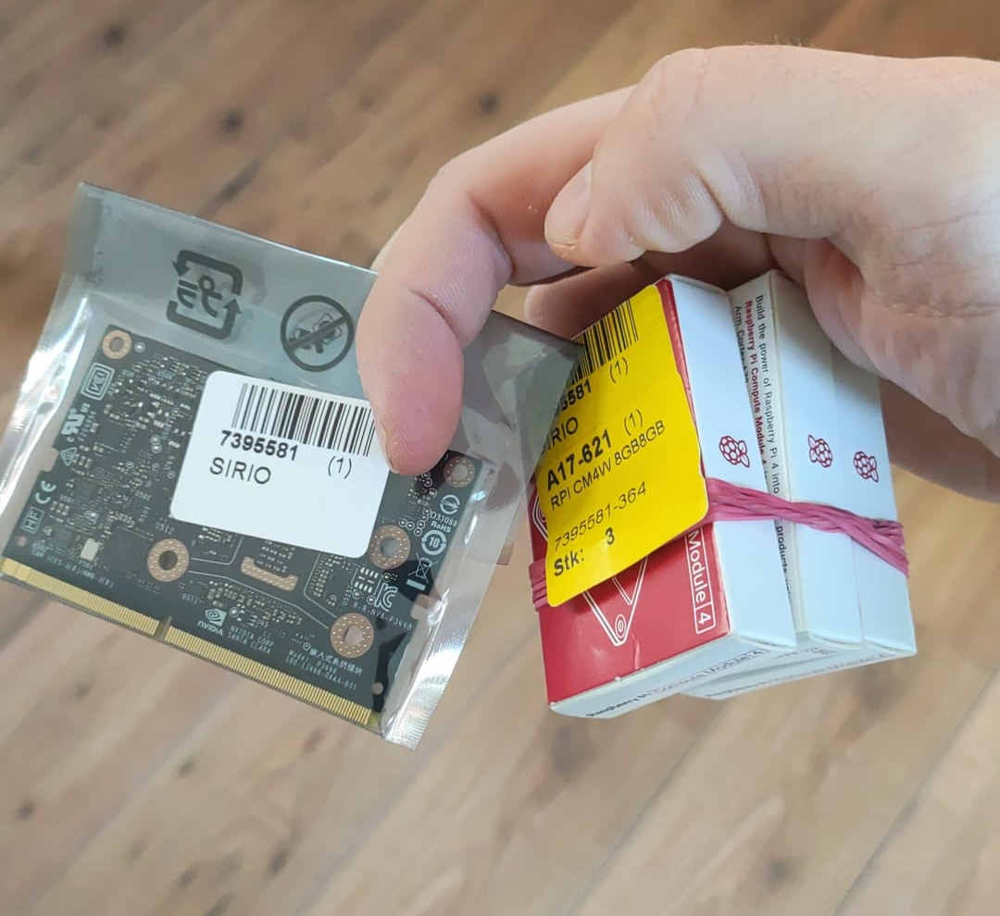

Given the board's versatility, I could mix different Compute Modules. I decided to include a Jetson Nano, thinking it might allow me to experiment with CUDA drivers in the future and delve into machine learning. Who knows? I might even end up hosting my own GPT assistant on this Kubernetes cluster.

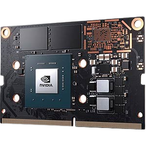

`(Spoilers: It didn't happen)`

## The Plan

My initial plan included the 3 Pi 4 CM and the Jetson Nano hosted in the board. Also, I planned to use a 1TB SSD drive for storage and a Wi-Fi card for internet access.
However, after encountering numerous difficulties with the Jetson Nano's setup process and its poor documentation, I decided to return it. Instead, I opted for a fourth Raspberry Pi 4. 

Additionally, I had an old Raspberry Pi 4 with 4GB of RAM lying around, so I decided to incorporate it as a fifth node.

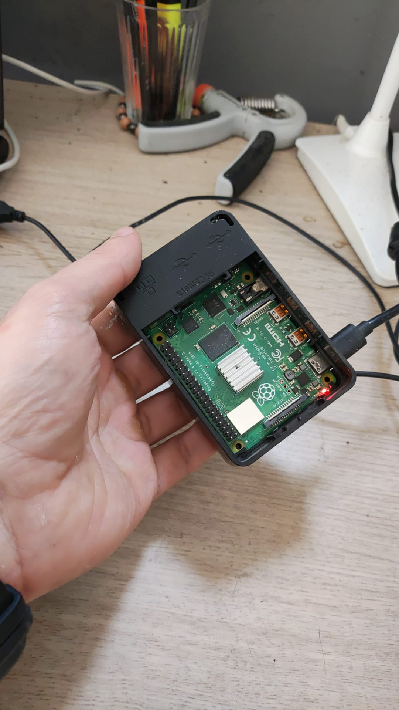

### Turing Pi 2

The Turing Pi 2 is a Mini ITX form factor board that can accommodate up to four Raspberry Pi Compute Modules (also compatible with Jetson Nanos and a Turing Compute Module). It features a PCI Express port, two NVME ports, two SATA ports, and a USB port for flashing the Compute Modules.

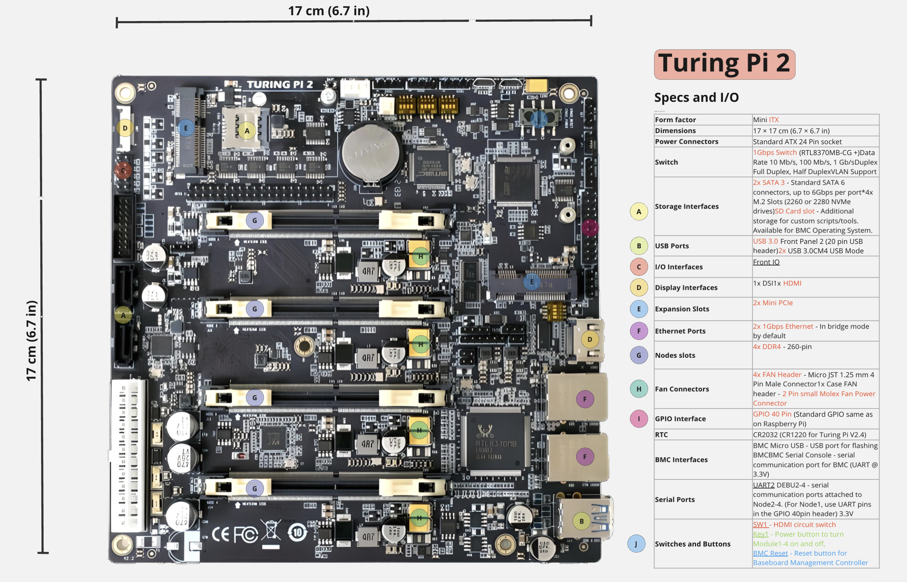
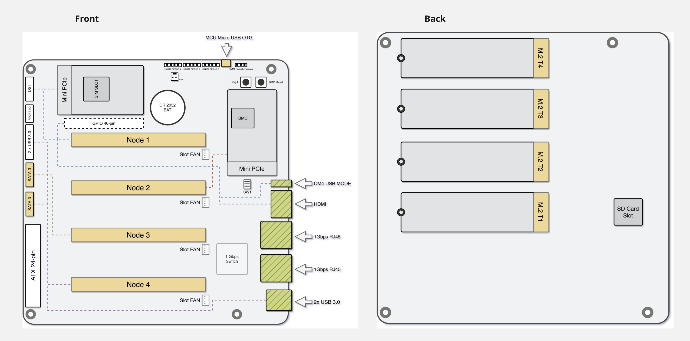

   - **Node 1**:
     - USB 2.0 port (For flashing the Compute Modules)
     - HDMI port (For debugging)
     - PCI Express port (For the Wi-Fi card)
   - **Node 2**:
     - I would use this one for NVME storage, but it's not compatible with Raspberry Pi 4s
   - **Node 3**:
     - The Sata ports, however, can be used here. So this node will have the NFS shared drive
   - **Node 4**:
      - USB 3.0 ports (If I ever need them)
   - **My Old Raspberry**:
     - Would be the Kubernetes master node. No special reason, I can think better about my setup this way

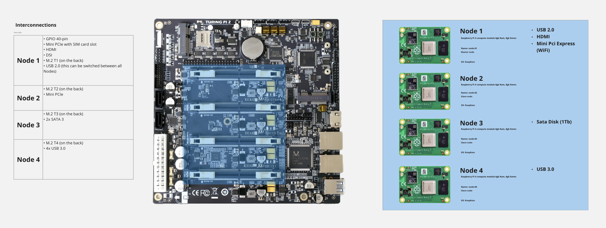


Ultimately, the idea is to host a Media Server with some add-ons

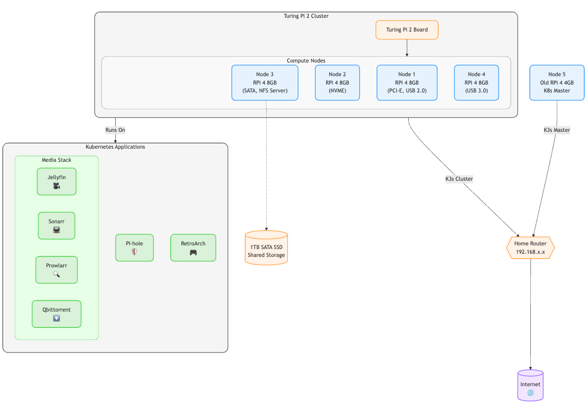

## The Set-up

It's been a while since I put together a computer, and it was the first time I played around compute modules with their Compute module adapters, so that was plenty of fun for the weekend.
Since my wallet was hot but still not burning, I thought, why the hell not add a nice case for it.

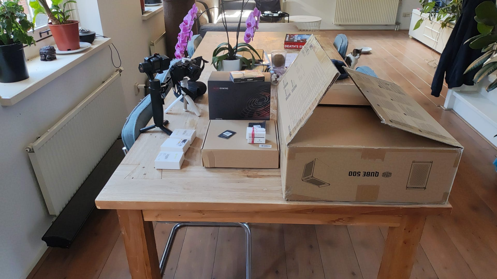

Given the Mini ITX form factor of the board, I could fit it into whatever fancy ITX case I could find in Amazon. The [Qube 500](https://www.coolermaster.com/en-au/products/qube-500-flatpack-bw-edition/) got me through and through. I was already making a DIY cluster, the best case for such a thing, was a DIY as well.

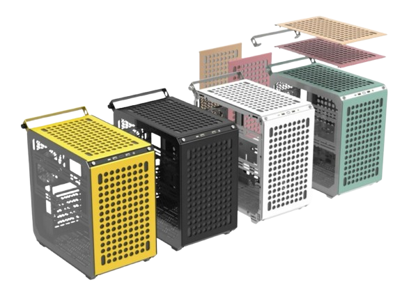

I also added a 650W power supply (total overkill), one small Wi-Fi Mini PCI Express cad and a 1tb Sata SSD.

Putting up the 'thing' together was fairly simple. A bit of thermal paste between the Compute Modules and their heat sinks and clutching them together with their Adapters before setting them up in order in the Turing Board;

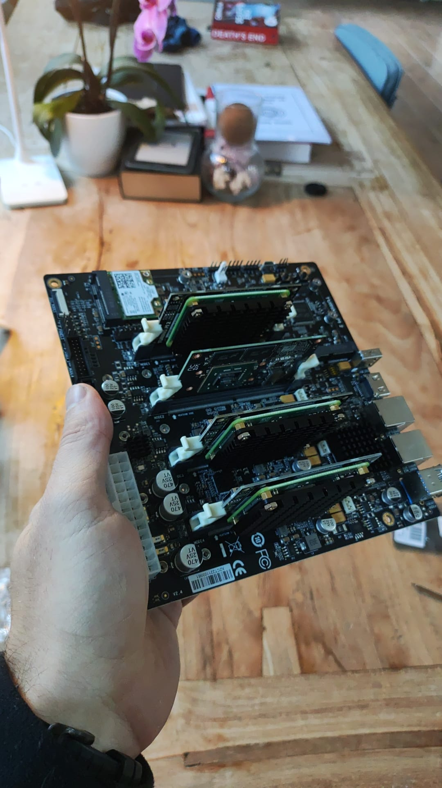

I mention the order because it was a significant part of the project. The Turing Pi 2 offers management of its ports distributed throughout the compute modules. In this case, the PCI Express 1 was managed by the First node while the SSD drive was managed by the 3rd one. The 2nd could handle the NVME port and the 4th one the other SSD IIRC but I had no use for them right now.

## The Flashing

I've installed Raspberry Pis before, but never Compute Modules. The Turing Pi 2 has a USB port in the back which is used for flashing the Compute Modules. 
Unfortunately, I tried using a USB A to USB A cable that was not a data transfer cable, so while I waited for Amazon to deliver a cable, I found another way of flashing the Compute Modules.

The Turing Pi 2 has a CLI tool that can be used not only to flash the Compute Modules but also to manage their power, reset then, check some stats and so on.

The command used for installing the Compute Modules was:

```bash
tpi flash -i /path/to/image -n {nodes 1 to 4}
```

Pretty straightforward process I thought to myself before realizing that the raspbian image doesn't come with SSH enabled by default.
This of course, is not Turing's responsibility. I should have waited for that cable, but oh well. 

To fix this, I had to mount the image in my local machine and add an empty file named `ssh` in the boot partition. This would enable SSH by default.

```bash
sudo mkdir /mnt/pi-boot
sudo mount /dev/sdX1 /mnt/pi-boot

sudo touch /mnt/pi-boot/ssh
sudo umount /mnt/pi-boot
```

Now all my pis were ready to be used. I connected them to the network and started configuring them. There was little to be configured since I was going to use them as Kubernetes nodes.
But things like vim and updating the system were necessary.

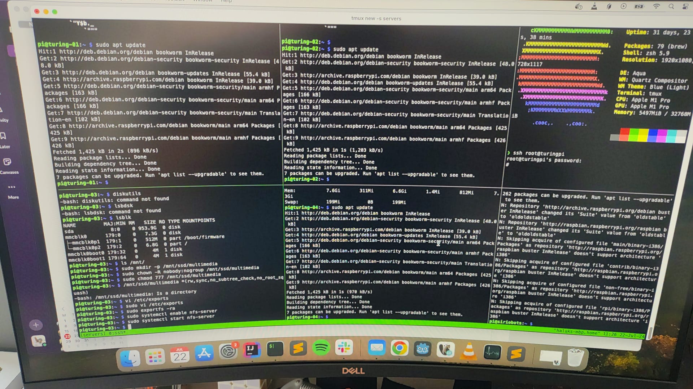

This also gave me the chance to learn how to use [Tmux](https://github.com/tmux/tmux). Best tool I've learned in a while.

### The Storage

If you recall a few paragraphs above, I mentioned that the 3rd node would be used for the NFS shared drive. I had a 1tb SSD drive that I was going to use for this purpose. I had to format it and mount it in the 3rd node. 
But I also needed to install the NFS server in this node and configure it in the other nodes. Is this recommended for a production environment? Hell no, but it's a home cluster, so I'm not too worried about it.

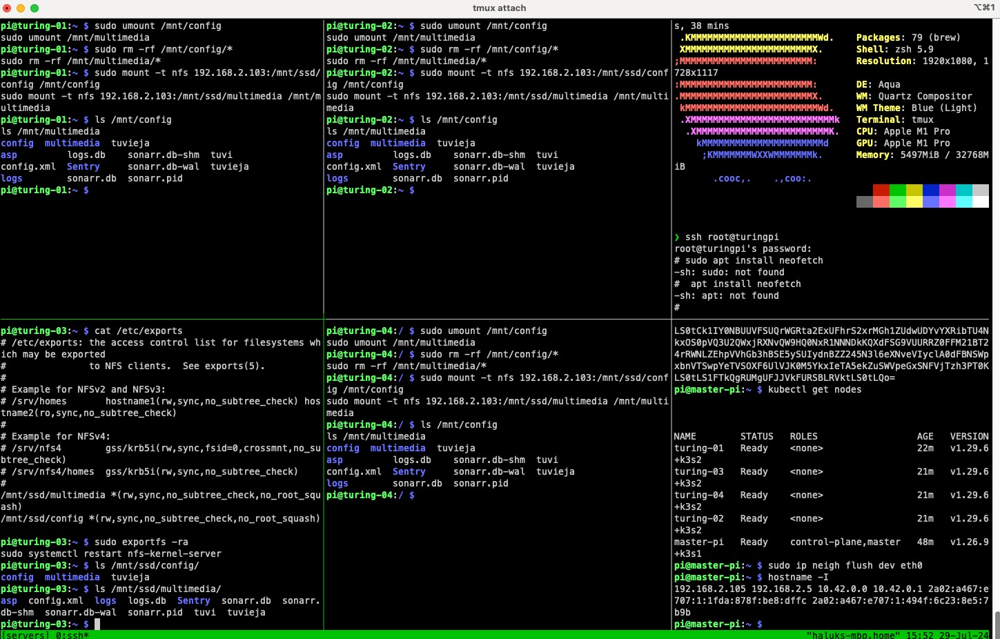

Here are the steps I took to configure the NFS server:

```bash
pi@turing-03:/mnt/ssd/data $ lsblk
NAME         MAJ:MIN RM   SIZE RO TYPE MOUNTPOINTS
sda            8:0    0 953.9G  0 disk /mnt/ssd
mmcblk0      179:0    0   7.3G  0 disk
├─mmcblk0p1  179:1    0   512M  0 part /boot/firmware
└─mmcblk0p2  179:2    0   6.8G  0 part /
mmcblk0boot0 179:32   0     4M  1 disk
mmcblk0boot1 179:64   0     4M  1 disk
```

First I checked the drive was mounted correctly. Then I installed the NFS server:

```bash
sudo mkdir /mnt/nfs_share
sudo mount /dev/sda /mnt/nfs_share
```

Added it to the fstab file to make sure it was mounted on boot:

(adding the following line to the `/etc/fstab` file)
```bash
echo '/dev/sda /mnt/ssd ext4 defaults 0 0' | sudo tee -a /etc/fstab
```

Now installing nfs-kernel-server:

```bash
sudo apt update
sudo apt install nfs-kernel-server
```

And adding my drive to the `/etc/exports` file:

```bash
echo '/mnt/ssd *(rw,sync,no_subtree_check,no_root_squash)' | sudo tee -a /etc/exports
```

Now on the other nodes I had to install nfs-common:

```bash
sudo apt update
sudo apt install nfs-common
```

And hooking the drive to each node:

```bash
sudo mount -t nfs {IP-for-the-drives-node}:/mnt/ssd /mnt
```

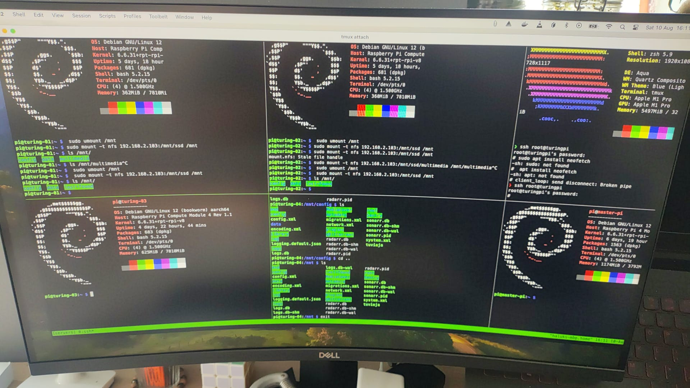
*[Neofetch](https://github.com/dylanaraps/neofetch) installed in all nodes because I'm fancy*

### The Kubernetes Cluster

I had never set up a Kubernetes cluster from scratch before, but I've been watching a lot of [Jeff Geerling's videos](https://www.youtube.com/@JeffGeerling) on the subject... This is experience enough, right?

Jeff led me to [K3s](https://k3s.io/) using [Ansible](https://github.com/k3s-io/k3s-ansible), a lightweight Kubernetes distribution that is perfect for my home cluster and a pre defined way of installing it because I don't have pre requirements nor the idea on how to set it up otherwise.

The installation was pretty straightforward. I had to install it in all nodes, but I had to make sure the master node was the first one to be installed.
So first I cloned the k3s-ansible repository:

```bash
git clone https://github.com/k3s-io/k3s-ansible.git
```

Then I had to configure the inventory file. My master node, as I mentioned before, was my old raspberry pi 4. So I had to make sure it was the first one in the inventory file. I also had to make sure the other nodes were in the correct groups.:

```yaml
k3s_cluster:
  children:
    server:
      hosts:
        192.168.2.105:
    agent:
      hosts:
        192.168.2.101:
        192.168.2.102:
        192.168.2.103:
        192.168.2.104:
```
In that same file I had to set up an encryption token. The file indicates how to do this so I won't go into details here.

Then I had to run the playbook:

```bash
cd k3s-ansible
ansible-playbook playbooks/site.yml -i inventory.yml
```

That's it. As far as the installation goes, I had a Kubernetes cluster up and running. I had to install [K9s](https://k9scli.io/) in my local machine to manage the cluster and bind the cluster to the `./kube/config` file.

## The Applications

Lastly, I had to install the applications I wanted to run in the cluster. I had some ideas on what I wanted.

- I wanted to have both a Media Server with scheduled downloads
- A [Pi-hole](https://pi-hole.net/) instance to  my network's DNS and block all ads in all devices at home
- A [Retroarch](https://www.retroarch.com/) instance to play some old games and share the save games across my home's network (looking at you Megaman Battlenetwork 6 in all my devices)

That's where [my repository](https://github.com/tomassirio/turing-pi-server) comes in.

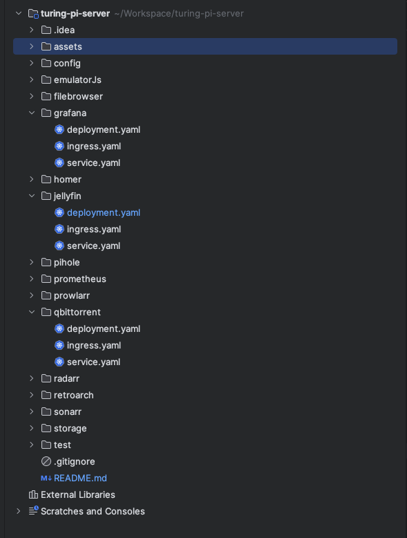


For the Media Server I decided to use:
- [Sonarr](https://sonarr.tv/)
- [Radarr](https://radarr.video/)
- [Prowlarr](https://prowlarr.com/)
- [Jellyfin](https://jellyfin.org/)
- [Qbittorrent](https://www.qbittorrent.org/)

As an example, I'll show you how I installed Sonarr using `kubectl`. The other applications were installed in a similar fashion.

For each Application, I created 3 files:

- `deployment.yaml` this is the configuration for each of the pods running the application

```yaml
apiVersion: apps/v1
kind: Deployment
metadata:
  name: sonarr
spec:
  replicas: 1
  selector:
    matchLabels:
      app: sonarr
  template:
    metadata:
      labels:
        app: sonarr
    spec:
      containers:
      - name: sonarr
        image: linuxserver/sonarr
        ports:
        - containerPort: 8989
        env:
        - name: PUID
          value: "911"
        - name: PGID
          value: "911"
        - name: TZ
          value: "Europe/Amsterdam"
        volumeMounts:
        - mountPath: /data
          name: data
        - name: config
          mountPath: /config
      volumes:
      - name: data
        persistentVolumeClaim:
          claimName: nfs-pvc
      - name: config
        persistentVolumeClaim:
          claimName: nfs-config-pvc
```

- `service.yaml` this is the configuration for the service that will expose the application to the cluster

```yaml
apiVersion: v1
kind: Service
metadata:
  name: sonarr
spec:
  selector:
    app: sonarr
  ports:
    - port: 80
      targetPort: 8989
  type: ClusterIP
```

- `ingress.yaml` and this is the configuration for the ingress that will expose the application to my network

```yaml
apiVersion: networking.k8s.io/v1
kind: Ingress
metadata:
  name: sonarr
spec:
  ingressClassName: nginx 
  rules:
  - host: sonarr.localhome.com
    http:
      paths:
      - path: /
        pathType: Prefix
        backend:
          service:
            name: sonarr
            port: 
              number: 80
```

Then we deploy all of them using `kubectl`:

```bash
kubectl apply -f sonarr/statefulset.yaml
kubectl apply -f sonarr/service.yaml
kubectl apply -f sonarr/ingress.yaml
```

As you can see, I'm using a NFS-backed persistent storage for the data and the configuration of the applications. 
In the repository you can find the [nfs-pv.yaml](https://github.com/tomassirio/turing-pi-server/blob/main/storage/nfs-pv.yaml) and [nfs-pvc.yaml](https://github.com/tomassirio/turing-pi-server/blob/main/storage/nfs-pvc.yaml) files that I used to create the NFS storage. 
Additionally, I created another persistent volume claim for the configuration of the applications. 


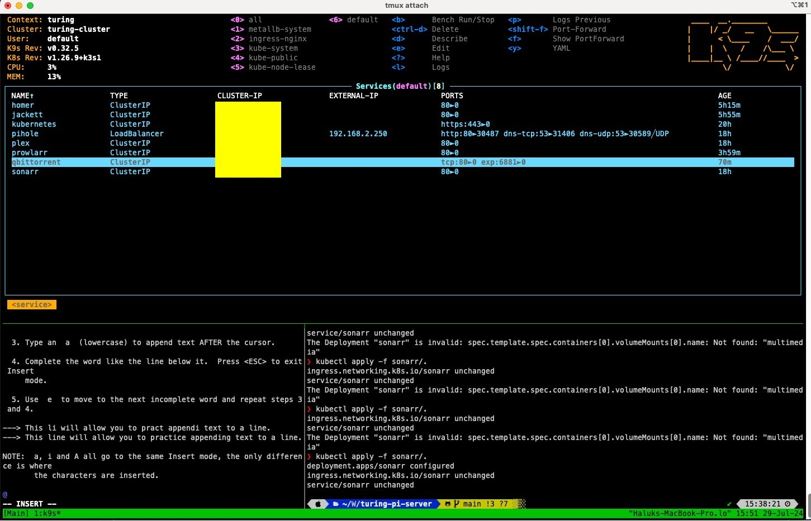

## The final build

Even though the case looks amazing, it's a bit too big for a Raspberry Pi Cluster. A Mini ITX case would have suited my needs as well, but I have to admit, I'm a sucker for the DIY stuff.


Also, a Sucker for LEDs in general. I didn't add any more lights to the case, I think that the board does a really nice job already.
Unfortunately the fan pins were not compatible with the board and I didn't buy a fan controller or a pin for the motherboard. I might in the future.

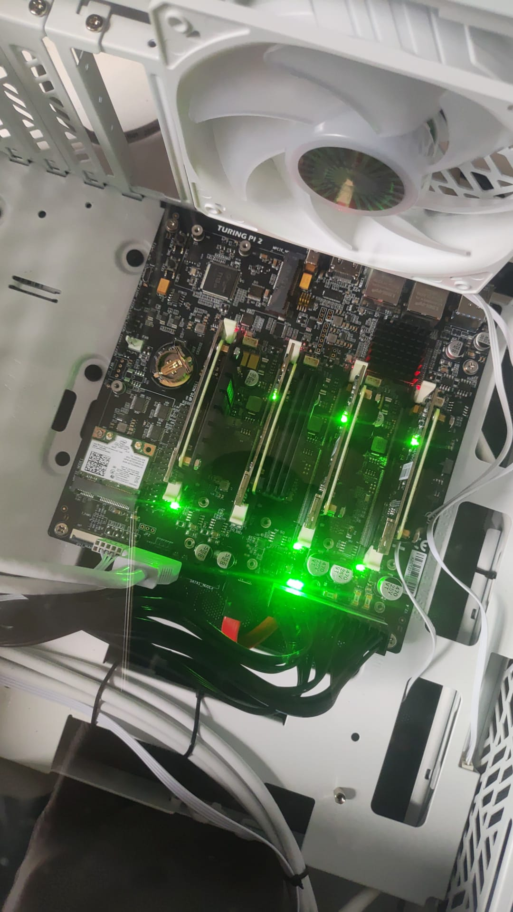

Sometimes you just have to sit back and enjoy the view. 

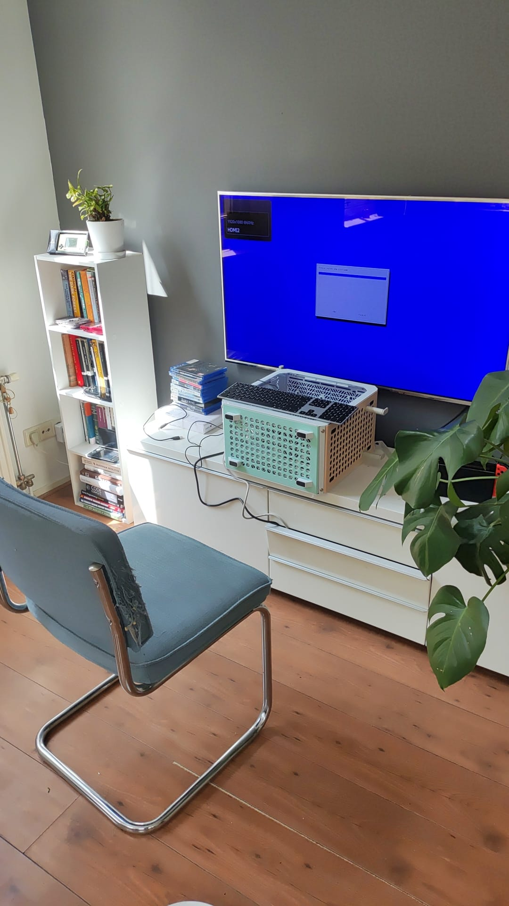

And finally, the Turing Pi 2 Home Cluster is up and running and my house is not a mess anymore.

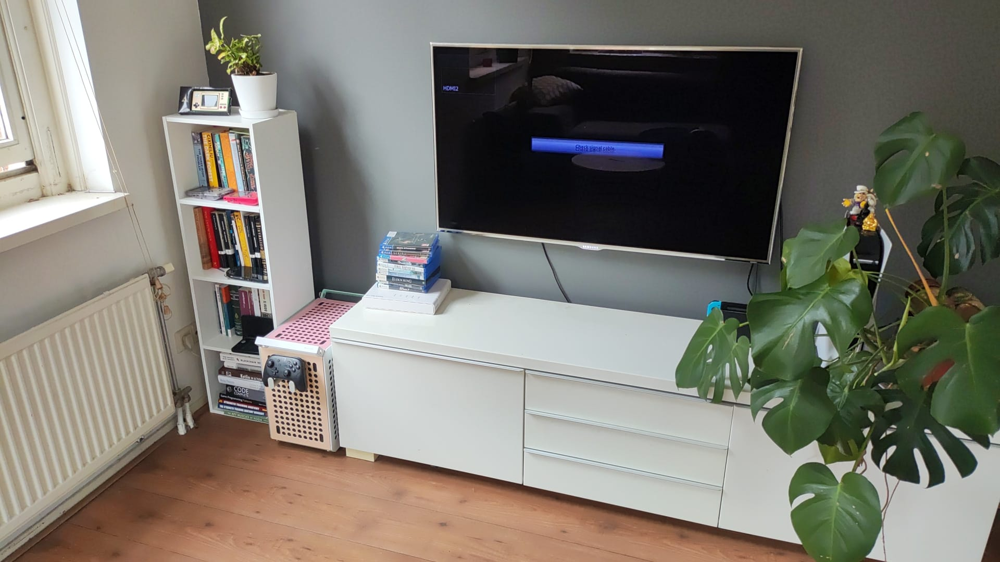

## The Future

Only time will tell what I'll do with this cluster. 
However, I've been thinking on adding [Prometheus](https://prometheus.io/) and [Grafana](https://grafana.com/) to have some metrics and nice graphs to check on the cluster.

Migrating all my kubernetes files to [Helm](https://helm.sh/) would be a good idea as well.

Lastly, the Retroarch instance is still in the works. Maybe in the works is a bit too optimistic given that the pod lives in CrashLoopBackOff state. But I'll get there.

## The End

If you've reached the end of this Post, I thank you for your time. I hope you've enjoyed it as much as I did both putting up the cluster together and writing it.